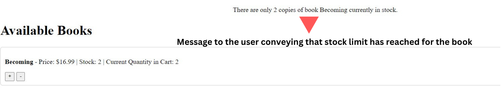
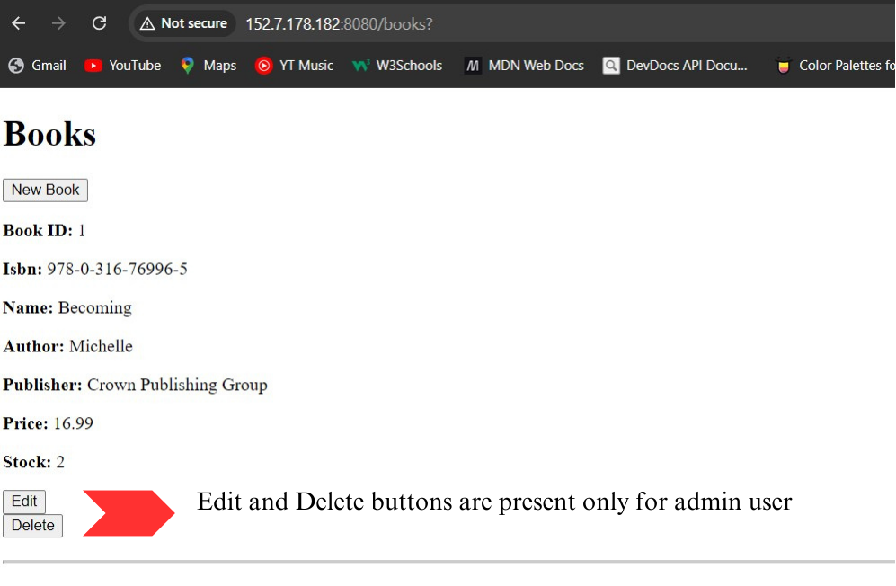
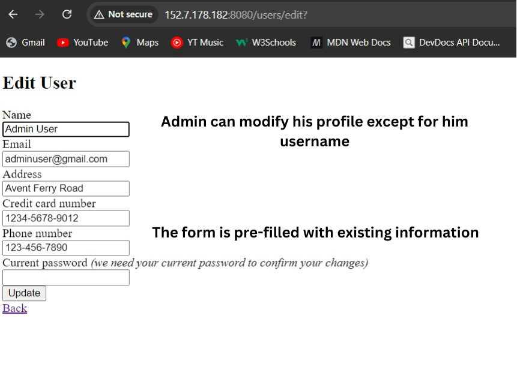

# Online Book-shopping System 
### Overview

This Ruby on Rails application implements an online book-shopping system with user and admin functionalities. Users can browse books, make purchases, write reviews, and manage their accounts. Admins have additional capabilities to manage users, books, and reviews.
### Login Credentials
#### Admin account
```bash
  Username : adminuser
  Password : admin@12345
```
#### Test user accounts
      Username: user1, Password: password1
      Username: user2, Password: password2
      Username: user3, Password: password3
      Username: user4, Password: password4
      Username: user5, Password: password5

### Functionality
#### For Users:
* Sign up/Login: Users can register a new account or login with existing credentials.
* Browse Books: Users can view available books with details like name, ISBN, Author, Publisher, Price and Stock left.
    * Navigation: Home → Display Books
    * Note: When the "Display Books" button is clicked in the user page, edit and delete options are not available for users. This functionality is reserved for admin accounts.
* Purchase Books: Users can buy a book adding it to the cart and checking out.
    * Cart Functionality: If a user attempts to purchase more than the available stock, a message will be displayed indicating the user has reached the maximum available stock for purchase.
    * Navigation: Home → View cart and buy book → Add to cart → Checkout 
<p align="center">

</p>

* View Purchase History: Users can view their past purchases.
    * Navigation: Home → View Purchase History
* Write/Edit a Review: After purchasing, users can write a review and give ratings for a book.
    *  Navigation: Home → Create and edit my reviews
* Manage Profile: Users can update/delete their account information. Most fields are pre-filled.
    * Navigation: Home → Edit Profile
#### For Admins:
* Add Books: Admin an add a new book on the inventory by filling the basic book details.
    * Navigation: Admin Dashboard → Manage Users
* Browse Books: When the "Display Books" button is clicked on the admin page, edit and delete options for books are available, as required by admin functionalities.
<p align="center">

</p>

* Manage Users: Admin can create, view, edit, and delete users. Admin cannot delete the pre-configured admin account.
    * Restrictions: Admin’s username and password fields are not editable, and there is no option to delete the admin account.
    * Navigation: Admin Dashboard → Manage Users
<p align="center">

</p>

* Manage Reviews: Admin can view and delete reviews written by users.
    * Navigation: Admin Dashboard → "Manage Reviews"
* Create Reviews: Admin can create new reviews for any username.
    * Navigation: Admin Dashboard → "Create Reviews"
### Tests
* Open your Gemfile and add the following in the Gemfile
```bash
group :test do
  gem 'rspec-rails', '~> 5.0.0'
  gem 'factory_bot_rails'
  gem 'faker'
end
```
* Run the bundle install command
* Run the following command to setup Rspec
```bash
rails g rspec:install
```
We have added testing for Book model and Book controller. To run the tests execute following:
```bash
bundle exec rspec
```
### Deployment
The application is deployed [here](http://152.7.178.182:8080/)
